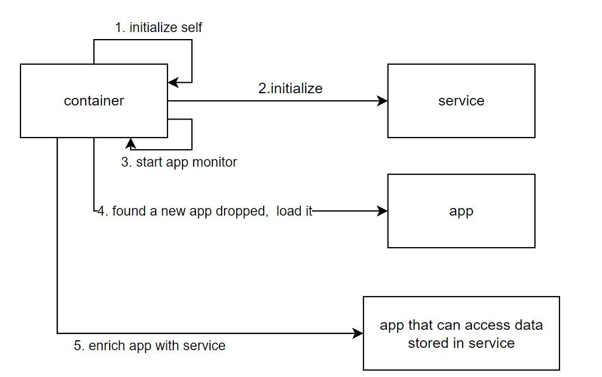

# General Java Container
a jvm-level sandbox container that **speed up project deployment** especially for heavy components that takes long to warm up.

    This project is inspired by tomcat container and unlike tomcat, the container can contain all kinds of regular Java and spring applications.**
# Main features    
 **Fast deployment, hot swappable (using classloader). The container is more like a sandbox and
 is especially suitable for huge java applications that needs long time to load caches, warm up before going into real business logic**

# Main concepts:

##  Service 
    (Stores data that need to be loaded, pre-compute,pre-prepared etc.)
**Service component provides heavy caches, operations, calculations that ideally should not be frequently redeployed during development.
just like the Servlet API, the container and app component should both import Service but app component should set maven scope to provided as container will import the real package.**

##  Application
    (where the real business logics being processed)
**the app will implement the real business logic and be packaged in a specific location for container automatically to pick up and load**

## Container
    (initialize service and keep it alive when app needs to be redeployed. load up-to-date app in no time and connect service component with app components(by putting service reference into app components), so that app can directly call service component)
**the container will initialize everything and all the supporting components:**
1.  it will firstly initialize itself and service components
2.  start file monitor to constantly monitor specific app location. 
3.  when there a new jar file dropped in the location, container will create a new class loader to load newly deployed jar file and try to discard the previous class loader if having one
4.  after app loading done, the container will offer the app the service component.
5.  the previously loaded app(with the same app name) will be garbage collected.
   
    

the project contains sample service and app component, you can change them to whatever you want. 

## for your already existing project, you need to split the code of heavy part and put it into Service component, and treat the light part as App component

feel free to reach out to me via email if you have any issues :)
